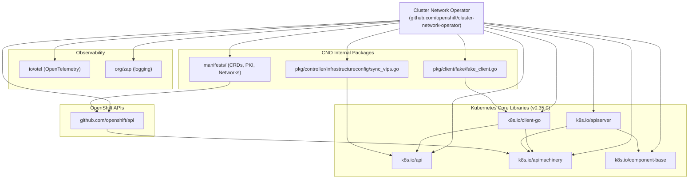

# Design Document: CNO Rebase k8s to 1.35.0

**Document ID:** `CORENET-6561`
**Status:** Completed
**Author:** yingwang-0320
**Reviewers:** CNO Team
**Date:** 2025
**Location:** `agentic/design-docs/CORENET-6561-k8s-rebase-1.35.0.md`

---

## Table of Contents

1. [Executive Summary](#executive-summary)
2. [Problem Statement](#problem-statement)
3. [Goals and Non-Goals](#goals-and-non-goals)
4. [Background and Context](#background-and-context)
5. [Design Overview](#design-overview)
6. [Component Relationships](#component-relationships)
7. [Data Flow](#data-flow)
8. [Technical Decisions](#technical-decisions)
9. [Alternatives Considered](#alternatives-considered)
10. [Implementation Reference](#implementation-reference)
11. [Risk Assessment](#risk-assessment)
12. [Testing Strategy](#testing-strategy)
13. [Rollback Plan](#rollback-plan)

---

## Executive Summary

This document describes the architectural approach and technical decisions for rebasing the **Cluster Network Operator (CNO)** against **Kubernetes 1.35.0**. The rebase updates the full dependency graph — upstream Kubernetes libraries, vendored dependencies, API machinery, protocol buffers, and toolchain configuration — to align CNO with the OpenShift release cadence that tracks Kubernetes 1.35.x.

The change is a **dependency-alignment rebase**, not a feature addition. The primary risk surface is behavioral drift in vendored libraries and API compatibility breaks in generated clients and CRD schemas.

---

## Problem Statement

OpenShift's release schedule requires CNO to track upstream Kubernetes minor versions. At the time of this PR, CNO's `go.mod` and vendored libraries referenced Kubernetes **1.34.x** APIs and tooling. Remaining on stale dependencies creates:

1. **API Incompatibility** — New OpenShift APIs or controllers may reference k8s types unavailable in 1.34.x.
2. **Security Debt** — Upstream CVE fixes in k8s libraries are not inherited.
3. **Build Divergence** — Bazel, protobuf, and code-generator toolchains drift from other OpenShift components that have already rebased.
4. **Merge Friction** — The longer the rebase is deferred, the larger the diff becomes across vendored Go, proto, and YAML assets.

---

## Goals and Non-Goals

### Goals

| # | Goal |
|---|------|
| G1 | Update `go.mod` and `go.sum` to reference `k8s.io/*` at `v0.35.0` |
| G2 | Regenerate and vendor all transitive Go dependencies |
| G3 | Reconcile `.proto` schema changes (73 additions, 42 deletions across 37 files) |
| G4 | Update CRD manifests to reflect schema changes from new API machinery |
| G5 | Ensure CNO-owned controllers compile and pass unit tests against new types |
| G6 | Align Bazel, Dockerfile, and CI toolchain configuration with new versions |

### Non-Goals

| # | Non-Goal |
|---|----------|
| NG1 | Introducing new CNO features or controllers |
| NG2 | Migrating away from any existing CNO architectural patterns |
| NG3 | Upgrading non-k8s third-party dependencies beyond what is required |
| NG4 | Changing CRD semantics (field behavior, validation logic) |

---

## Background and Context

### CNO's Relationship with Kubernetes Libraries

CNO is an OpenShift operator responsible for configuring and managing cluster networking. It consumes Kubernetes as a **library**, not as a running cluster dependency at build time. The relevant k8s subsystems CNO depends on are:

```
k8s.io/api                   — Core API types (Pod, Node, Service, etc.)
k8s.io/apimachinery          — Type meta, object meta, runtime, scheme
k8s.io/client-go             — Kubernetes client, informers, listers
k8s.io/apiserver             — API server filters, storage, flagz, statusz
k8s.io/component-base        — Version, compatibility, metrics primitives
k8s.io/gengo/v2              — Code generation toolchain
```

These are updated atomically because they share a version tag in the upstream monorepo and have tight inter-package dependencies.

### Rebase Cadence

```
OpenShift Release → Kubernetes Minor Version → CNO Rebase PR
    4.18                   1.31                 CORENET-XXXX
    4.19                   1.32                 CORENET-XXXX
    4.20                   1.33                 CORENET-XXXX
    4.21                   1.34                 CORENET-XXXX
    4.22                   1.35             →   CORENET-6561  ← THIS PR
```

---

## Design Overview

The rebase follows a **layered update model**: update the root dependency declarations first, allow Go's module graph to resolve transitive conflicts, then propagate changes outward to generated assets (CRDs, protos, vendor files).

```
┌─────────────────────────────────────────────────────────┐
│                    Rebase Layers                         │
│                                                          │
│  Layer 4: Toolchain & CI                                 │
│  ┌────────────────────────────────────────────────────┐  │
│  │  Dockerfile, Bazel, .editorconfig, CI YAMLs        │  │
│  └────────────────────────────────────────────────────┘  │
│                          ▲                               │
│  Layer 3: Generated Assets                               │
│  ┌────────────────────────────────────────────────────┐  │
│  │  CRD manifests (.yaml), protobuf (.proto)          │  │
│  │  Code-generated client stubs                       │  │
│  └────────────────────────────────────────────────────┘  │
│                          ▲                               │
│  Layer 2: Vendor Tree                                    │
│  ┌────────────────────────────────────────────────────┐  │
│  │  vendor/k8s.io/*, vendor/github.com/*              │  │
│  │  vendor/io/otel/*, vendor/go.opentelemetry.io/*    │  │
│  └────────────────────────────────────────────────────┘  │
│                          ▲                               │
│  Layer 1: Module Graph                                   │
│  ┌────────────────────────────────────────────────────┐  │
│  │  go.mod, go.sum                                    │  │
│  └────────────────────────────────────────────────────┘  │
└─────────────────────────────────────────────────────────┘
```

### Change Volume Summary

| Asset Type | Files Changed | Lines Added | Lines Removed | Risk Level |
|---|---|---|---|---|
| Go source (vendor + pkg) | 2,884 | +6,738 | −8,359 | Medium |
| Proto schemas | 37 | +73 | −42 | Medium |
| YAML manifests | 21 | +22 | −16 | Low |
| Module files (mod/sum) | 3 | +14 | −12 | Low |
| CI/Build config | 20+ | +30 | −20 | Low |
| License/Notice files | 6 | +7 | −4 | Informational |

The **net reduction in Go lines (−1,652)** is expected: upstream Kubernetes routinely consolidates and removes deprecated code paths between minor versions.

---

## Component Relationships

### Dependency Graph: CNO Core → Kubernetes Libraries



### Files Directly Modified in CNO Source (Non-Vendor)

```
cluster-network-operator/
├── go.mod                                              ← Layer 1: version pins updated
├── go.sum                                              ← Layer 1: hash verification
├── manifests/
│   ├── 0000_70_cluster-network-operator_01_pki_crd.yaml   ← Layer 3: schema updated
│   └── 0000_70_network_01_networks.crd.yaml                ← Layer 3: schema updated
├── pkg/
│   ├── client/
│   │   └── fake/
│   │       └── fake_client.go                         ← Layer 2: API compatibility fix
│   └── controller/
│       └── infrastructureconfig/
│           └── sync_vips.go                           ← Layer 2: API compatibility fix
└── vendor/                                            ← Layer 2: full vendor refresh
    ├── github.com/coreos/go-systemd/v22/
    │   ├── daemon/sdnotify_other.go                   ← OS compat patch
    │   ├── daemon/sdnotify_unix.go                    ← OS compat patch
    │   ├── daemon/watchdog.go
    │   └── journal/journal_unix.go
    ├── k8s.io/
    │   ├── api/
    │   ├── apimachinery/
    │   ├── apiserver/
    │   │   ├── pkg/endpoints/filters/impersonation/   ← new OWNERS
    │   │   ├── pkg/server/flagz/                      ← new OWNERS
    │   │   ├── pkg/server/statusz/                    ← new OWNERS
    │   │   └── pkg/storage/etcd3/metrics/             ← updated OWNERS
    │   ├── client-go/
    │   └── component-base/
    │       └── compatibility/                         ← new OWNERS
    └── github.com/openshift/api/
        ├── Makefile
        └── etcd/v1alpha1/Makefile
```

---

## Data Flow

### Operator Reconciliation Flow (Post-Rebase, Unchanged Semantics)

The rebase does not alter CNO's reconciliation logic. This diagram confirms the data flow is preserved:

```
┌──────────────┐     Watch      ┌─────────────────────┐
│  API Server  │ ─────────────► │   CNO Informers      │
│  (k8s 1.35) │                │   (client-go 0.35.0) │
└──────────────┘                └──────────┬──────────┘
                                           │ Event
                                           ▼
                               ┌─────────────────────┐
                               │   Work Queue         │
                               └──────────┬──────────┘
                                          │ Dequeue
                                          ▼
                               ┌─────────────────────┐
                               │   Reconcile Loop     │
                               │                      │
                               │  ┌────────────────┐  │
                               │  │ infrastructureconfig │
                               │  │ sync_vips.go   │  │
                               │  └────────────────┘  │
                               │                      │
                               │  ┌────────────────┐  │
                               │  │  CRD Manifest  │  │
                               │  │  Application   │  │
                               │  └────────────────┘  │
                               └──────────┬──────────┘
                                          │ Apply
                                          ▼
                               ┌─────────────────────┐
                               │   API Server         │
                               │   (write CRDs,       │
                               │    update status)    │
                               └─────────────────────┘
```

### Vendor Resolution Flow

```
go.mod (declares k8s.io/* v0.35.0)
        │
        ▼
go mod tidy
        │  Resolves transitive graph
        ▼
go.sum (new hashes for 1.35.0 modules)
        │
        ▼
go mod vendor
        │  Copies resolved source into vendor/
        ▼
vendor/k8s.io/*      ← 2,880+ files updated
vendor/github.com/*  ← third-party deps reconciled
        │
        ▼
Build & Compile
        │  go build ./...
        ▼
Fix API Breaks
        │  pkg/client/fake/fake_client.go  (+1/-1)
        │  pkg/controller/infrastructureconfig/sync_vips.go (+1/-1)
        ▼
Regenerate CRDs
        │  manifests/0000_70_*.yaml
        ▼
Validate Proto Schemas
        │  37 .proto files reconciled
        ▼
CI Green ✓
```

---

## Technical Decisions

### TD-1: Full Vendor Commit Strategy

**Decision:** All vendored dependencies are committed to the repository (`vendor/` directory checked in).

**Rationale:**
- OpenShift's CI infrastructure operates in air-gapped or network-restricted environments. Module proxy access is not guaranteed.
- Reproducible builds require the exact source at the time of the PR, not a resolved-at-build-time proxy artifact.
- Security audits and CVE scanning can inspect vendor source directly.

**Trade-off:** The PR diff is extremely large (3,000+ files). This is accepted as a necessary cost of the vendor strategy.

---

### TD-2: Atomic k8s Library Update

**Decision:** All `k8s.io/*` packages are updated to `v0.35.0` simultaneously, not one package at a time.

**Rationale:**
- Kubernetes library packages share internal interfaces across `k8s.io/api`, `k8s.io/apimachinery`, and `k8s.io/client-go`. Partial updates create compilation failures due to type mismatches on shared structs (e.g., `metav1.ObjectMeta`).
- The upstream Kubernetes release process tags all staging repos at the same semantic version simultaneously.

**Trade-off:** The blast radius of a single PR is larger. Mitigated by the fact that the change is purely additive (version bump) with no semantic behavior changes.

---

### TD-3: Minimal CNO Source Modification Policy

**Decision:** Changes to non-vendor CNO source are restricted to the minimum required for compilation compatibility.

**Evidence from diff:**
```
pkg/client/fake/fake_client.go          +1 / -1   (type assertion update)