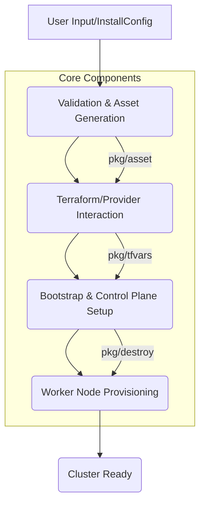

# AGENTS.md - OpenShift Installer Agent Entry Point

This document is the primary entry point for AI agents navigating the `openshift/installer` repository. It provides a structured overview, key navigation points, and essential context. For detailed information, follow the links to the `agentic/` directory.

## 1. Getting Started

- **Repository Description**: The OpenShift Installer is responsible for deploying OpenShift clusters across various cloud providers and bare metal. It generates cluster assets, configures infrastructure, and orchestrates the bootstrap process.
- **Goal**: Deploy a functional OpenShift cluster.
- **Main Language**: Go
- **Key Components**: `pkg/asset`, `pkg/types`, `data`, `cmd`

## 2. Repository Overview

### 2.1. High-Level Architecture (Installer Flow)

### 2.2. Core Concepts

| Concept          | Description                                    | Deep Dive                                    |
| :--------------- | :--------------------------------------------- | :------------------------------------------- |
| `InstallConfig`  | Primary configuration for a new cluster.       | [agentic/domain/concepts/install-config.md](agentic/domain/concepts/install-config.md) |
| `Asset`          | Generated artifacts (Terraform, Ignition, etc.)| [agentic/domain/concepts/assets.md](agentic/domain/concepts/assets.md) |
| `Provider`       | Cloud/platform specific implementations.       | [agentic/domain/concepts/providers.md](agentic/domain/concepts/providers.md) |
| `Manifests`      | Kubernetes resources for cluster components.   | [agentic/domain/concepts/manifests.md](agentic/domain/concepts/manifests.md) |
| `Bootstrap`      | Temporary cluster for control plane bring-up.  | [agentic/domain/concepts/bootstrap.md](agentic/domain/concepts/bootstrap.md) |
| `Ignition`       | OS configuration for nodes.                    | [agentic/domain/concepts/ignition.md](agentic/domain/concepts/ignition.md) |

### 2.3. Key Invariants

- **`InstallConfig` Validity**: All `InstallConfig` fields must be valid and consistent for the target platform.
- **Asset Idempotence**: Generating assets multiple times with the same `InstallConfig` must produce identical outputs.
- **Platform Consistency**: Provider-specific assets must correctly reflect the desired cluster state on the target platform.
- **Bootstrap Success**: The bootstrap process must reliably bring up a functional control plane.
- **Resource Cleanup**: `openshift-install destroy` must remove all created resources.

## 3. Critical Code Locations

- `cmd/openshift-install`: Main entry point for the installer CLI.
- `pkg/types/installconfig.go`: Defines the `InstallConfig` struct.
- `pkg/asset/`: Contains the core asset generation logic.
    - `pkg/asset/cluster/installconfig.go`: Handles `InstallConfig` loading and validation.
    - `pkg/asset/cluster/terraform.go`: Orchestrates Terraform asset generation.
    - `pkg/asset/ignition/`: Ignition configuration generation.
- `pkg/tfvars/`: Generates Terraform variables for different providers.
- `pkg/destroy/`: Logic for cluster teardown.
- `data/`: Contains static manifest templates and provider-specific configurations.

## 4. Development & Testing

- **Build Command**: `make build`
- **Test Command**: `make test`
- **Provider-specific tests**: Refer to `hack/` directory for local environment setup and specific provider test instructions.

## 5. Agentic Deep Dive

For comprehensive, structured knowledge, navigate the `agentic/` directory.

- **Design Documents**: [agentic/design-docs/index.md](agentic/design-docs/index.md)
    - Core Beliefs: [agentic/design-docs/core-beliefs.md](agentic/design-docs/core-beliefs.md)
    - Component Architecture: [agentic/design-docs/component-architecture.md](agentic/design-docs/component-architecture.md)
- **Domain Knowledge**: [agentic/domain/index.md](agentic/domain/index.md)
    - Glossary: [agentic/domain/glossary.md](agentic/domain/glossary.md)
- **Execution Plans**: [agentic/exec-plans/active/](agentic/exec-plans/active/) (Work in progress)
- **Decisions (ADRs)**: [agentic/decisions/index.md](agentic/decisions/index.md)
- **Required Framework Docs**:
    - [agentic/DESIGN.md](agentic/DESIGN.md)
    - [agentic/DEVELOPMENT.md](agentic/DEVELOPMENT.md)
    - [agentic/TESTING.md](agentic/TESTING.md)
    - [agentic/RELIABILITY.md](agentic/RELIABILITY.md)
    - [agentic/SECURITY.md](agentic/SECURITY.md)
    - [agentic/QUALITY_SCORE.md](agentic/QUALITY_SCORE.md)

---
*Generated by AI Agent. For framework details, refer to the Executive Summary.*